Learn Databricks 

Vid 1 - fundamentals

* For technical course, see get started onboarding series
* Aspects of data

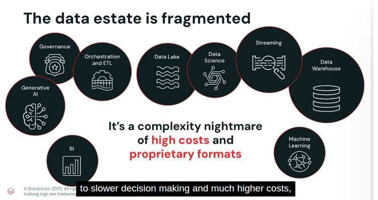

* Democratize Data and AI = make data lakehouse for unified AI workloads, simplii

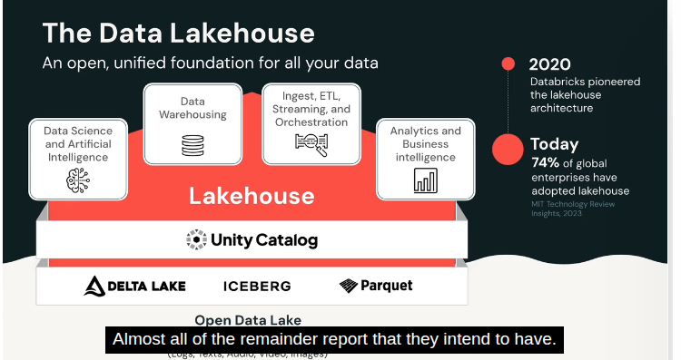

* Given low AI projects implementation rate, databricks combine lakehouse and generative ai to make data intelligence platform to democratize data and ai

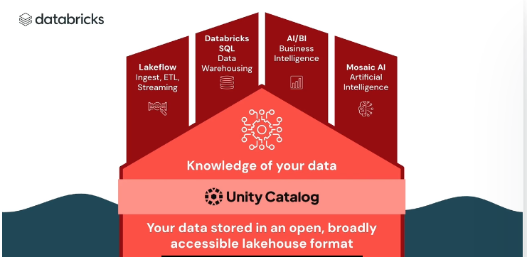

Vid 2 -- data intelligence platform 

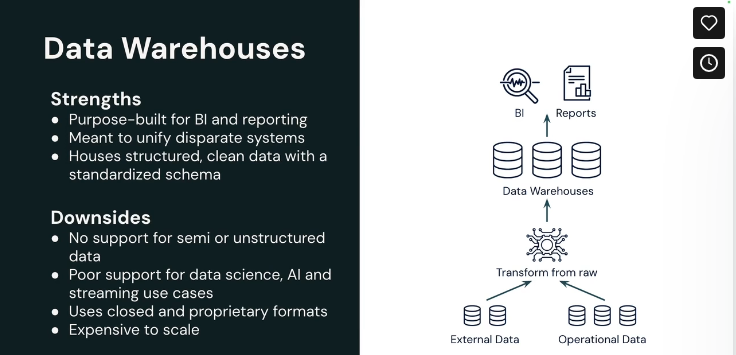

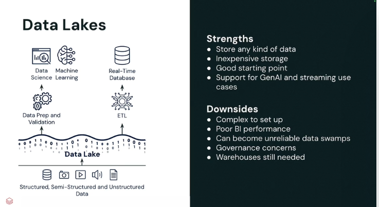

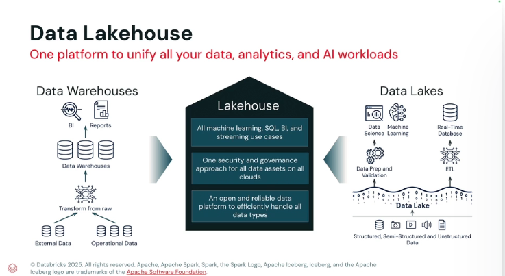

Data intelligence = using ai to understand enterprise data, better than LLM 

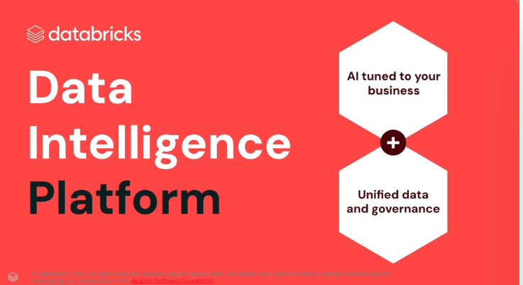

vid 3 - databricks architecture

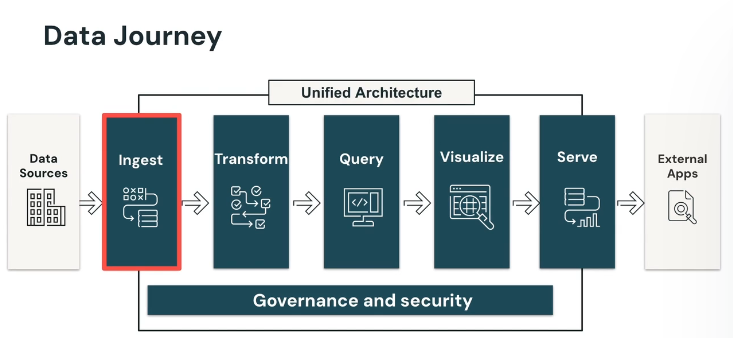

data ingestion done by data engineers -- getting data 'inside' the platform

data transform improve data quality 

query perform actions to gain insights 

serve example = deploying AI model

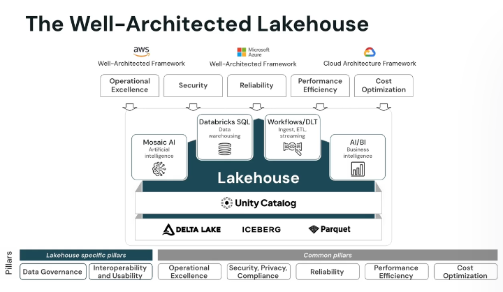

databricks use external cloud providers 

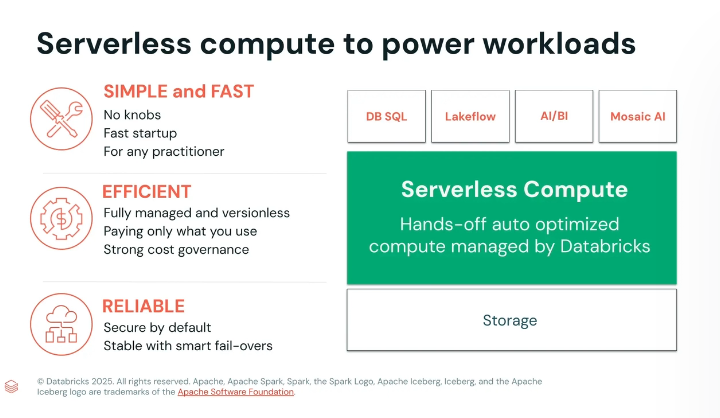

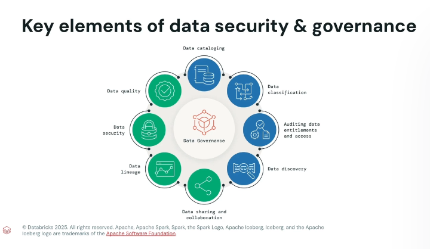

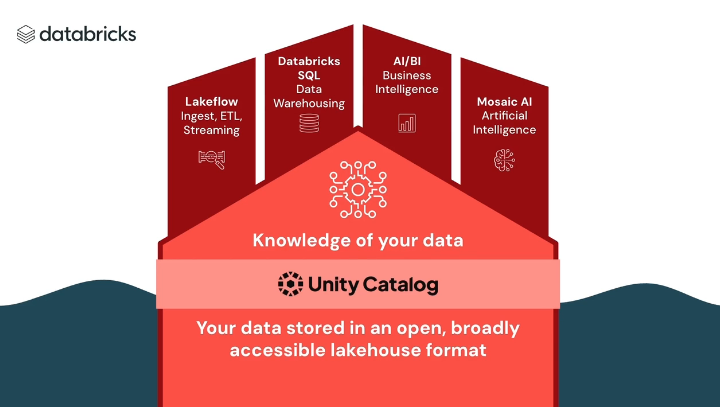

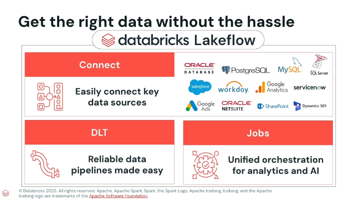

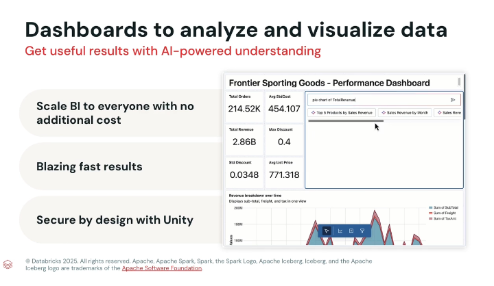

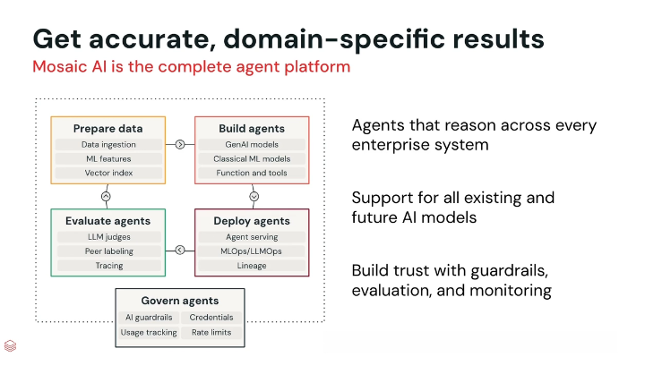

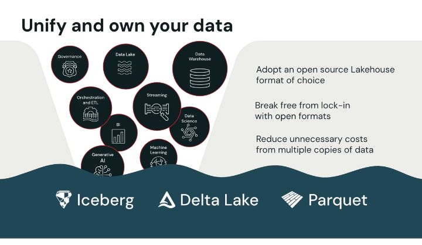

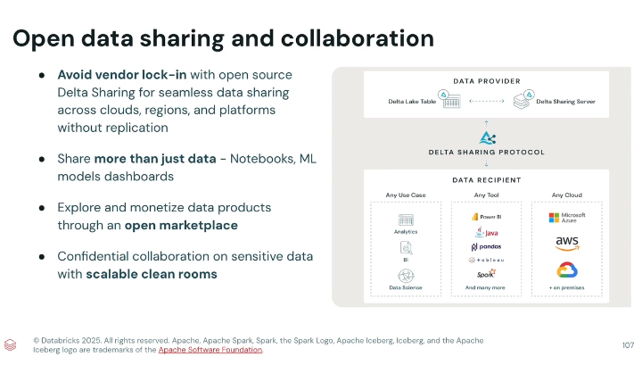

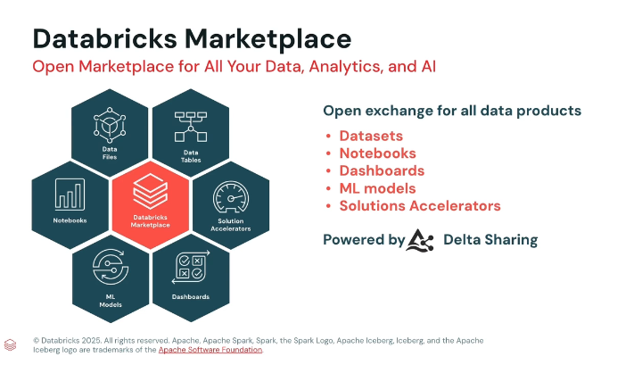

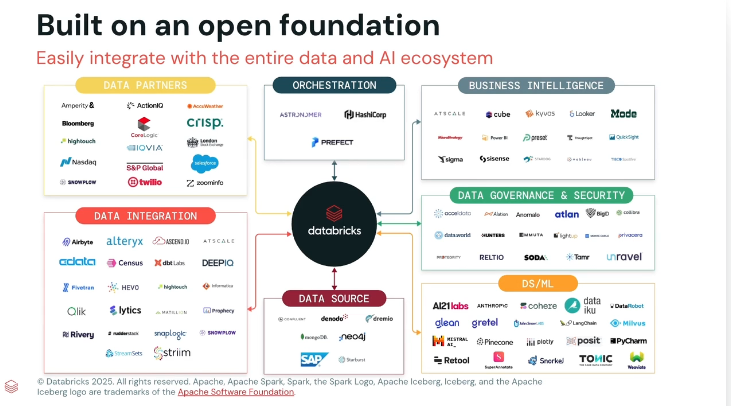
