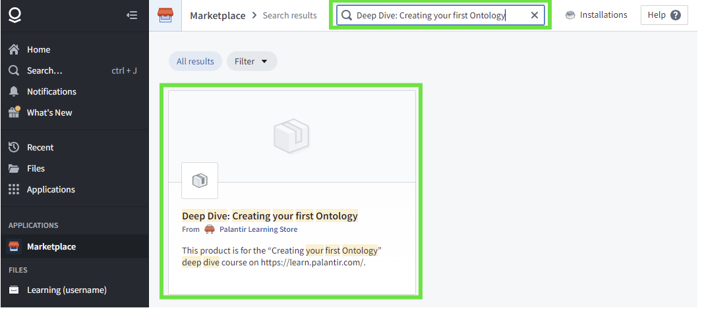
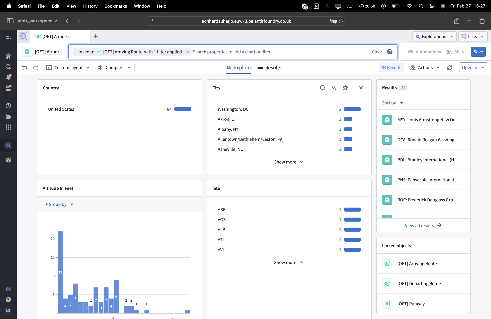
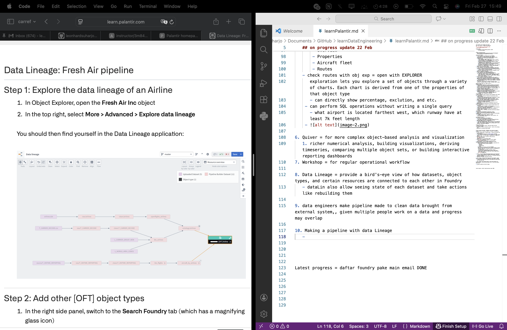
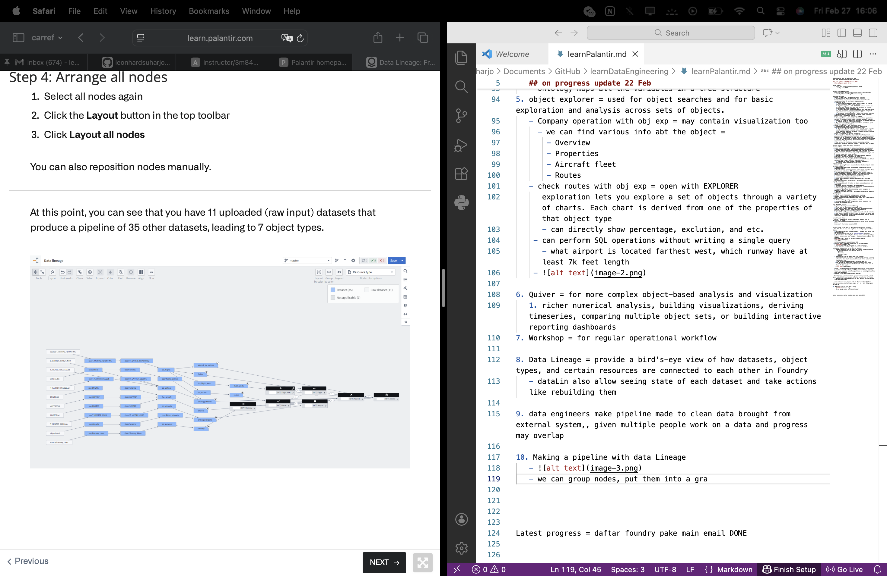
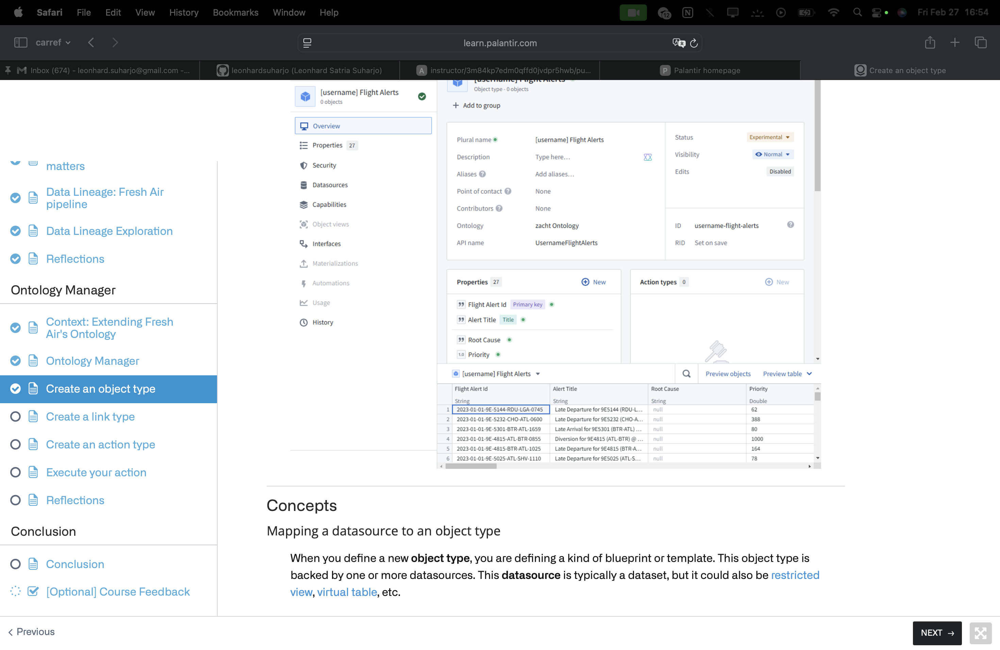
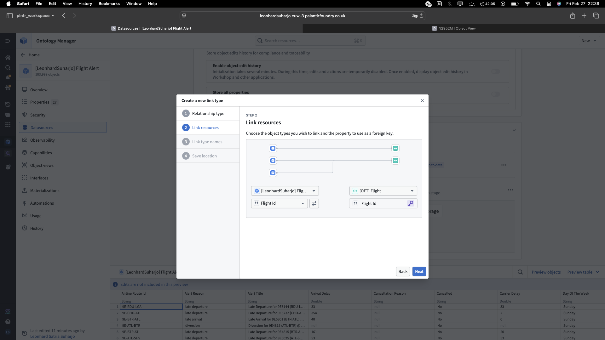
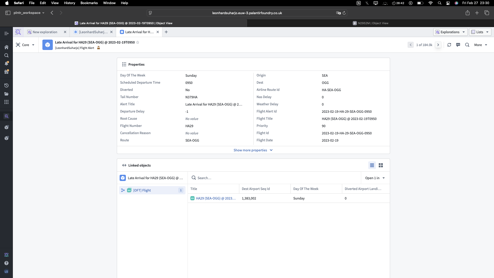
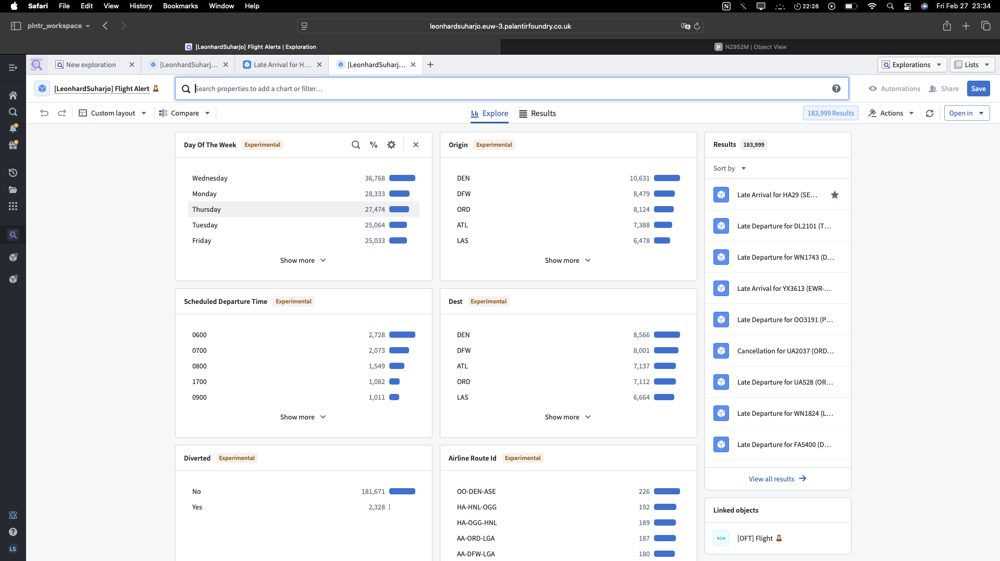

Learn Palantir main markdown notes page 
main chat resource = chatgpt and perplexity

###  Last updated on 12 Feb Thursday 2026 
   ## on progress update 22 Feb

Target today = 
   - finish perp review regarding palantir chat#1 
     - rev key terms DONE 

Palantir course main link = 
   https://accounts.skilljar.com/accounts/profile/3nutzhbug1pbu?d=3nutzhbug1pbu&next=%2Fpage%2Fcourse-catalog

Total courses taken = 
1. Course 1: Deep Dive - Building Your First PIPELINE
   1. Core Objective: Master Palantir’s data ingestion, transformation, and pipeline orchestration capabilities—the foundational layer of any Foundry implementation
   2. Specific parts 
      1. Data integration module taught you to connect to diverse sources (databases, APIs, cloud storage)
      2. Pipeline (pipeline = DATA PROCESSING) builder section was critical: you learned to create Code Workbooks for custom transformations using PySpark and SQL
      3. ONTOLOGY section = introduced semantic data modeling—linking raw data to business concepts so that downstream analytical applications can meaningfully interact w data
      4. automation and orchestration = taught you to chain pipelines
   3. Essential part = SPARK patterns including window functions, complex joins, incremental loading
2. Course 2: Deep Dive - Data Analysis in CONTOUR
   1. Core objective: Learn point-and-click analytical application building for dataset-focused exploration and dashboard creation
   2. Contour is Foundry’s analytical application for dataset analysis
      1. whereas quiver is time-series focused 
   3. Key terms = board types, path construction, parameters, pivot operations, aggregation summaries 
3. Course 3: Deep Dive - Data Analysis in Quiver
   1. Core objective: Master OBJECT-ORIENTED analysis for ontology-backed data with time-series capabilities.
      1. Key terms = Object analysis, canvas (visual cards) & graphs (actual computation), transform tables, TIME-SERIES (enable trend analysis) analysis, parameter (dynamic filters), derived columns, visual functions
4. Course 4: Foundry & AIP Builder Foundations
   1. Core objective: Introduce the architecture that connects pipelines (data ingestion/transformation) with ontology (semantic modeling) and AI integration through natural language interfaces
   2. Three MAIN capabilities of palantir with ontology as centerpiece = pipelines FEED the ontology, Quiver/Contour ANALYZE it, Workshop apps interact with it
   3. Key terms = LLM functions, document processing, entity resolution, automated redaction (redact = edit/pull back for edit)

Personal project ideas (for legacy courses) = 
Pipeline related = 
1. Global Military Spending ETL & Analytics Pipeline (most balance)
   1. demonstrates end-to-end pipeline engineering using publicly available, professionally-used datasets from SIPRI and world bank 
   2. ETL == Extract, Transform, Load == It refers to the data pipeline process used to turn fragmented, raw defense budgets into a unified, comparable global dataset.
   3. Medium post idea = "Building a Military Spending Analytics Pipeline” + interactive dashboard on top of it.
2. Equipment Sensor Data Streaming Pipeline (difficult)
   1. Building a real-time pipeline that ingests SENSOR data, detects ANOMALIES, and triggers ALERTS -- pipeline skills 
      1. Simulate IoT sensor streams (equipment temperature, vibration, power consumption) using Kafka
Contour related 
1. Military Spending Trends & Economic Context Dashboard (most viable but less relevant)
   1. demonstrates analytical thinking and visualization skills, defense economies
   2. Ingest military spending pipeline output (from Project A above) plus economic indicators (GDP, population, inflation)
   3. Create parametrized Contour analysis with filters: country, region, time range, spending category, with boards to visualize
2. Geopolitical Risk & Defense Spending Correlation Analysis 
   1. combines data analysis with strategic thinking. 
   2. connected to strategic consulting 
   3. risky due to personal opinion (who quantifies risk?) and possible bias 
3. Equipment Maintenance Optimization & Performance Analysis (solid project, realistic)
   1. leverages Quiver’s strengths in object-oriented analysis and time-series
   2. Ontology objects: Equipment, performanceMetric
   3. do cost effeciency, performance correlation, anomaly detection (sudden drops), replacement recommendation  
   4. supports operational decision making (which equipment to maintain, repair, or replace)
   5. Medium article = “Building a Maintenance Optimization Analysis in Quiver”
Other projects 
4. Military asset UTILIZATION and deployment tracking 
5. Document classification and redaction system (risky)
6. Supply chain risk intelligence platform (vague term, need complex implementation)
   1. Bridges ontology design, analytics, and AIP
   2. ontology, pipeline, aip integration, quiver analysis, risk scoring, workshop app, alerts 

Next PROJECTED courses =
1. Deep Dive: Creating Your First Ontology
   1. to be used in maintanance-tracking project 
   2. Key topics: Object modeling, link types, action definitions, ontology manager interface, relationship cardinality
2. Deep Dive: Building Your First Application
   1. done AFTER ontology design, used to translate into UI interface 
   2. Key topics: Workshop structure (core vs. basic), variables and widgets, layout design, integration with ontology objects, action invocation, operational dashboards

Current latest status = 
- created a new palantir account, same email address thou NO certificate is synced
  - next step = take only necessary courses -- which is the ontology course
- review short of previous projects DONE 

#######################################################################################################################################
Palantir study last upd 27 Feb 2026 -- ONTOLOGY course learning insights 

Medium article idea = Making my first ontology with Palantir foundry 
Subtitle = Role of ontology in data engineering 

1. The data that is used most regularly in Foundry is presented as objects 
   1. EX = airline object, customer object ; contain info pulled from various sources 
2. The **ONTOLOGY** defines the set of **object types** available. 
   1. Each instance of Foundry has its own unique set of object types that are unique ; use case example = pharmaceuticals company, mil company 
3. Must have DIRECT access to palantir foundry web app 
    
   setup DONE 
   install workspace from marketplace DONE 
4. Exercise one -- simulate as employee of airline company
   - 
   - ontology maps all the variables in a tree structure 
5. object explorer = used for object searches and for basic exploration and analysis across sets of objects.
   - Company operation with obj exp = may contain visualization too 
     - we can find various info abt the object = 
       - Overview 
       - Properties 
       - Aircraft fleet 
       - Routes 
   - check routes with obj exp = open with EXPLORER
      exploration lets you explore a set of objects through a variety of charts. Each chart is derived from one of the properties of that object type
      - can directly show percentage, exclution, and etc. 
    - can perform SQL operations without writing a single query 
      - what airport is located farthest west, which runway have at least 7k feet length
    - 

6. Quiver = for more complex object-based analysis and visualization 
   1. richer numerical analysis, building visualizations, deriving timeseries, comparing multiple object sets, or building interactive reporting dashboards
7. Workshop = for regular operational workflow

8. Data Lineage = provide a bird's-eye view of how datasets, object types, and certain resources are connected to each other in Foundry
   - dataLin also allow seeing state of each dataset and take actions like rebuilding them
  
9. data engineers make pipeline made to clean data brought from external system,, given multiple people work on a data and progress may overlap

10. Making a pipeline with data Lineage 
   - 
   - we can group nodes, put them into a graph structure, and automatically manage the layout 
   - 
   - we can filter nodes by their origin repository, as they will have different colors depending on the rules/filter set 

11. exercise = build your own version of the Flight Alert OBJECT type -- make our own OBJECT type 
    - an object to represent the situation whenever a Flight is delayed, cancelled, or diverted. 
    - Each Flight Alert can then be responded to by Fresh Air’s Flight Operations department -- thus creating a WORKFLOW
    - use **Ontology Manager** == section that enables you to build and maintain your organization’s Ontology. 
      - you can also define object and link types from Pipeline Builder, but OntologyManag has more options 
    - steps 
      1. open ontology manager, use flight alerts as datasource 
      2. set properties,, namely the '**primary** key' and '**title**'
         1. PRIMARY KEY = a unique identifier that is consistent for the life of that object; unique and never null 
            1. random ID generator shouldnt be used for PK because, if the pipeline is ever rerun, all of your object IDs will change
         2. TITLE = user-friendly and HUMAN-READABLE name of the object in search results and in most Foundry applications.
      3. 
      4. mapping data source to object type
         1. datasource is typically a dataset, but it could also be restricted view, virtual table, etc.
         2. Column = object property like 'First Name'; Row = object instance like individual 
      5. ACTIONS = controlled way to create, edit, and/or delete objects
    - **overall model**
      1. Customer Dataset belonging to Customer Object 
      2. Column = object property (example = 'First Name') 
      3. Row = object instance
    - **object storage** = the next stage after saving the object, it will undergo a process where if Foundry encounters any issues—such as non-unique primary keys—you’ll be able to get to detailed job details and error messages from here.
       - 

12. Creating a LINK TYPE = used to navigate from alert to corresponding object -- uses key terms that doesnt only exist in foundry 
    - 
    - **object FK** = a foreign key property in one object type contains values that appear as a PRIMARY key value in another object type.
    - cardinality = indicates how many entities might be involved on the two sides of that relationship.
      - example = one to many
      - modelling over time may differ than present context modelling 
      - one flight may have more than one flight alerts / delays 

13. Creating an ACTION type = given an alert, an operation will be done in response, and it will be done in an organized steps called workflow -- which is done in the FOUNDRY == Actions provide a controlled way to update objects
    1.  Change edit permissions, then make a new action type 
    2.  use the previously made flight alert object 
    3.  Action FORM = every action invoked, a common input form will collect the necessary input from a user.
        1.  ename input fields, assign default values, hide fields, set root cause value 
    4.  'Submission criteria' = control to specify who can invoke the action at al
    5.  Rules, Side-effects, & Functions = example: modify object rule 
   
14. Executing action = 
    1.  use object explorer to open an alert and assess its properties 
        1.  
        2.  
    2.  make a sample root cause
   
15. Conclusion list of possible workflow operation of a flight company team, given delay alert of a flight ID, that is given to the operations team = 
      Assign an incoming Flight Alert to a given Flight Operations operator
      Forward the alert to the local Flight Maintenance team for processing
      Reassign the flight crew
      Queue for passenger rebooking
      Update the gate assignment
      Reschedule this aircraft’s next flight
      Swap aircraft for this aircraft’s next scheduled flight
      Make as resolved

   - information needed for that kind of operation/workflow
      Flight crew status and availability
      Plane availability for swaps
      Passenger counts and destinations to inform tradeoffs between plane swaps and rebooking
   
   Ontology make a digital copy of a organization workflow 

[Grand course conclusion -- exact wording copas] 
1. why the Ontology is valuable.
   It makes data easier to use.
   It structures data into a vocabulary that is reusable across workflows and across the organization.
   The Ontology provides well-defined actions that can enforce constraints and make the output of regular decisions immediately to others within the platform.
1. correlation with AI 
   Ontology allows you to integrate AI into daily operations.
   Ontology can provide clean and usable inputs to AI like how to deal with alerts 
      Ontology structures these concepts in real-world terms that an LLM are already familiar with.
   Ontology provides a destination for AI outputs,, AI recommendations (or AI's end-product) will be stored inside the ontology object itself 
      easier to then collect feedback on the final decisions
2. Tools used in the course
   Object Explorer - For object searches and for basic exploration and analysis across sets of objects
   Data Lineage - For exploring data pipelines and understanding how they lead to the Ontology
   Ontology Manager - For building the Ontology itself
3. Other tools 
   Object Views - The Airline and Airport objects you explored in this tutorial had custom object views
   Quiver - For powerful point-and-click analysis of object sets and dashboarding
   Workshop - For building operational applications from point-and-click widgets
   Ontology SDK (OSDK) - Building custom third-party applications that treat the Ontology as a backend

Latest progress = official course done 

Personal reflection = 
This is the first palantir foundry course i took with true dedication and so far its been great, i finished the course and sort of get an understanding of what the ontology does and even what data engineering does in general. The good thing is that the Palantir Foundry is turns out to be a very solid data engineering platform with a ton of features that can be really handy if i really know how to use each buttons to its max potential. the cons of it is that any project i will do from here will probably and most likely need to actually directly use this foundry platform and i need to further learn how to utilize it that means. good news is that it converge with knowledge from my uni database class

Course-specific reflection
about the course what I find valuable is that the course gives me the chance to apply the actual knowledge of foundry by opening the foundry itself and applying my skill in it, the guide and step by step is also very detail. the only downside is that a few of the guides are no longer relevant, for example some buttons are missing bcs maybe by the time the tutorial is wrote it was still in the previous app version. also there should be a test or evaluation or more real world projects involving the foundry itself to train my skills further, anything else is good.

